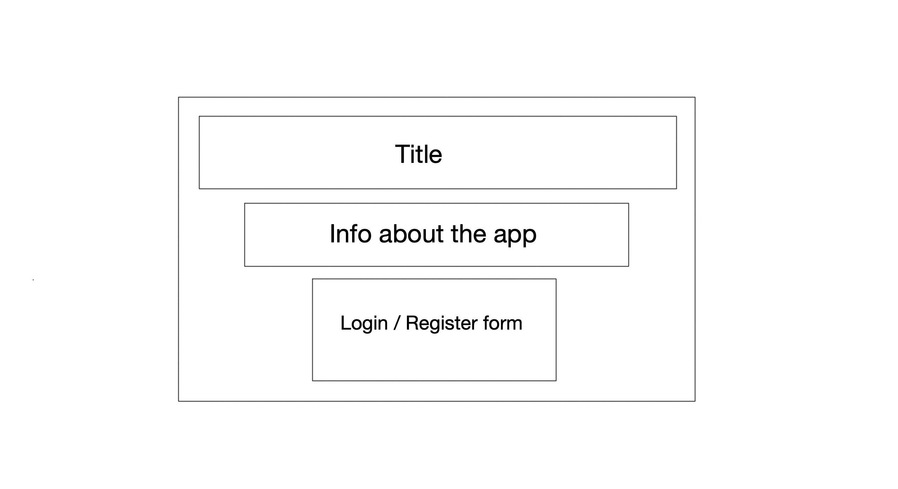
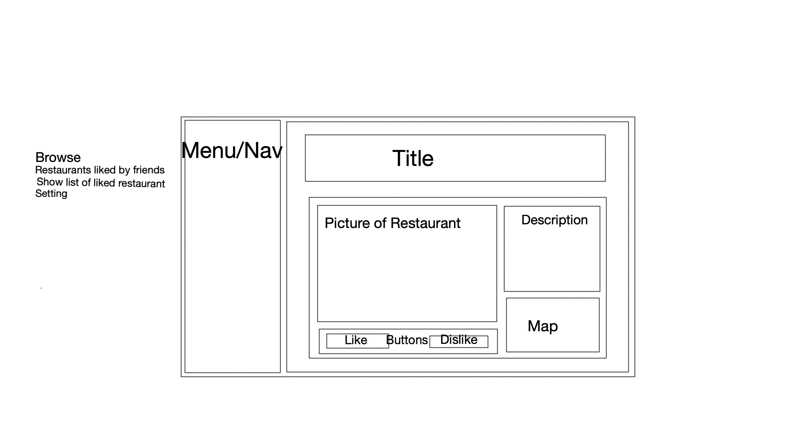
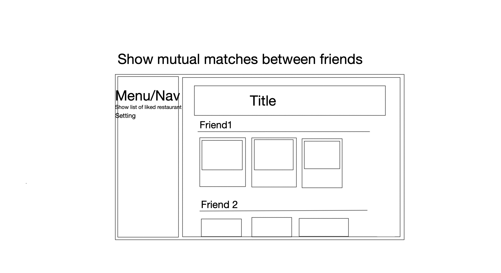
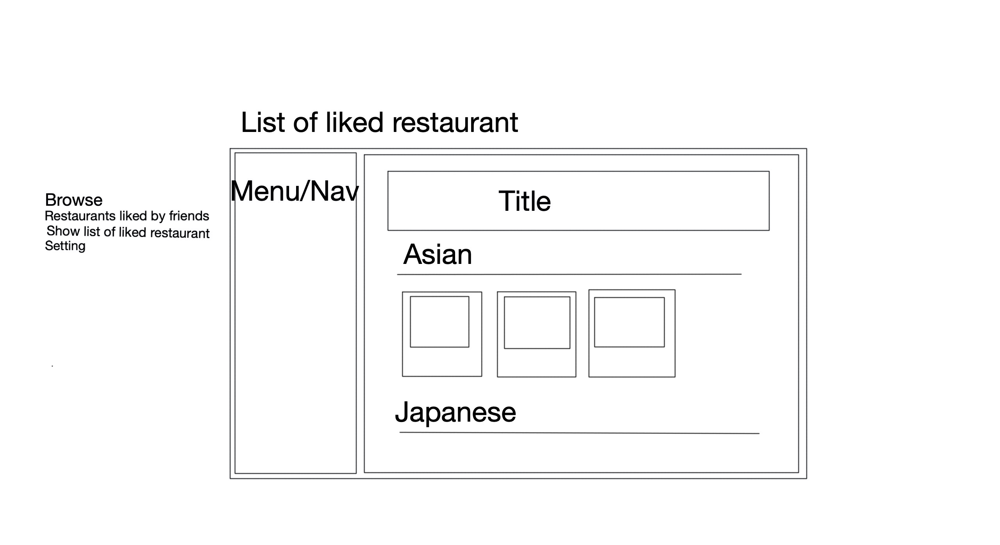
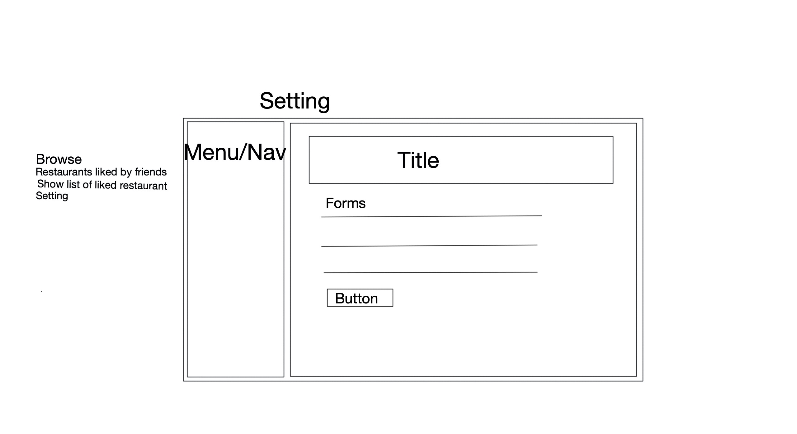
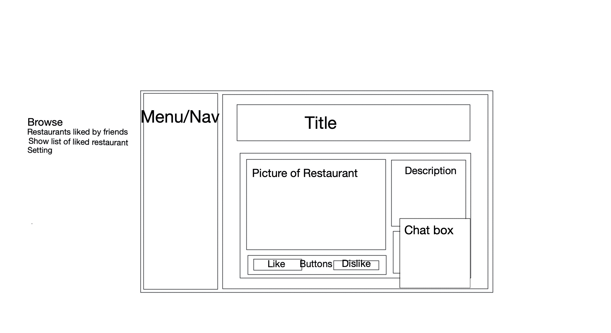

# track-restaurant-react

## user story:
1. user can register and log in to use the app, add other users as friend or remove them as friend.
2. user can browse list of restaurants with the selected type and near their area. And like the restaurant or dislike the restaurant. 
3. user can also browse a list of restaurants that their friends like in their area.
4. user can chat with other users with chat boxes (optional)
5. user will get notification when other user interact with them (optional)

## wireframes:

